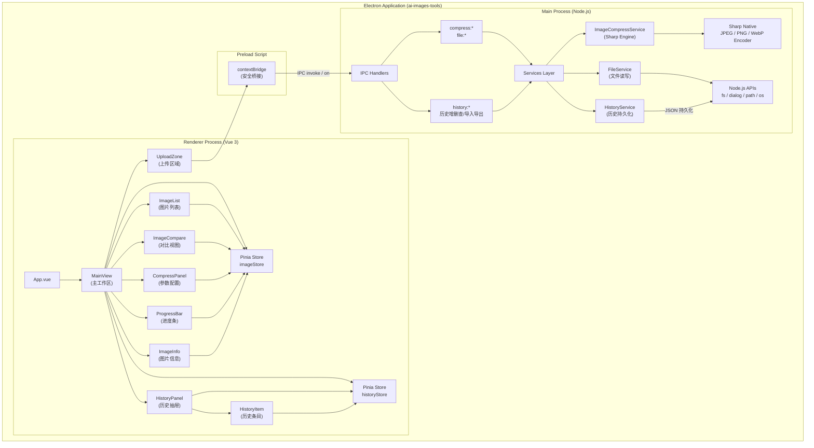
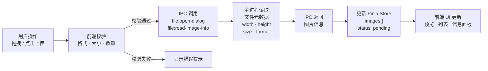
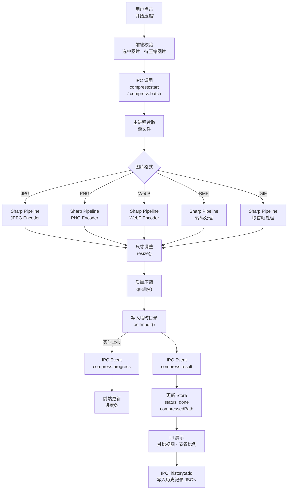
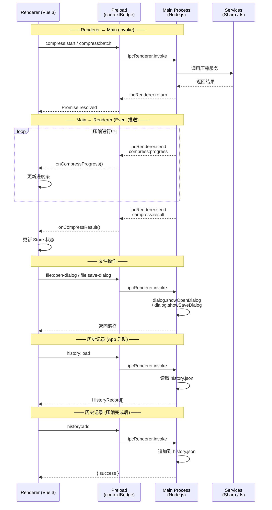
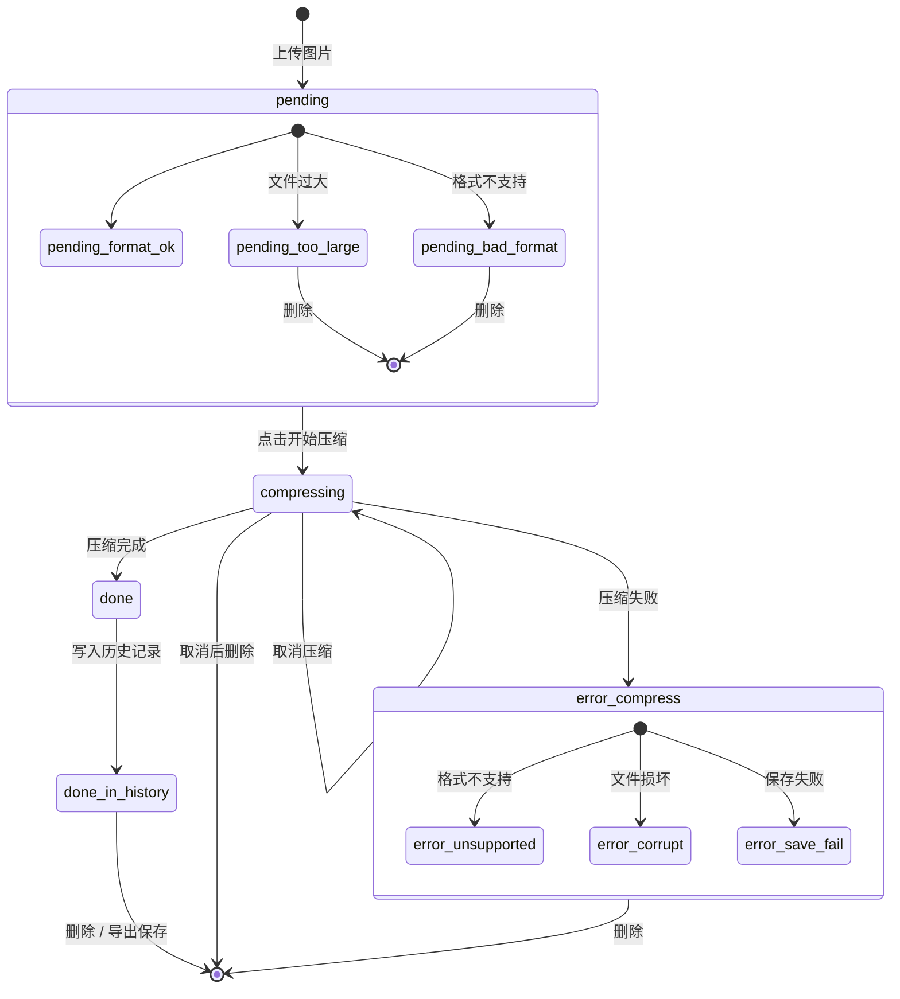
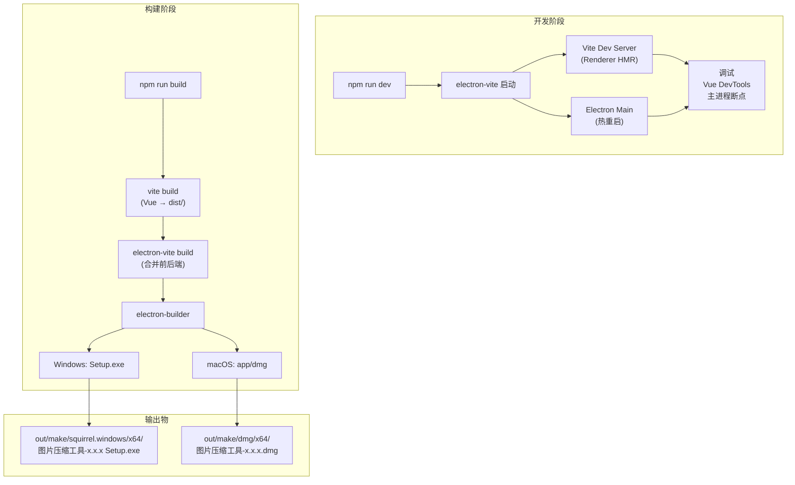

# 技术架构流程图

> **文档版本：** V1.0
> **关联文档：** 《技术方案.md》

---

## 一、整体架构图

---

## 二、数据流向图

### 2.1 图片上传数据流

### 2.2 图片压缩数据流

---

## 三、IPC 通信通道图

### IPC 通道一览表

| 通道名称 | 方向 | 类型 | 参数 / 返回值 |
|---|---|---|---|
| `file:open-dialog` | R → M | invoke | args: `filters[]` → returns: `string[]` (路径) |
| `file:save-dialog` | R → M | invoke | args: `{ defaultPath }` → returns: `string` |
| `file:read-image-info` | R → M | invoke | args: `{ filePath }` → returns: `{ width, height, size, format }` |
| `file:save-to-path` | R → M | invoke | args: `{ compressedPath, targetPath }` → returns: `{ success, finalPath }` |
| `compress:start` | R → M | invoke | args: `{ id, filePath, options }` → returns: `{ id, status }` |
| `compress:batch` | R → M | invoke | args: `{ images[], options }` → returns: `{ batchId, status }` |
| `compress:cancel` | R → M | invoke | returns: `{ success }` |
| `compress:progress` | M → R | Event | payload: `{ id, progress }` |
| `compress:result` | M → R | Event | payload: `{ id, compressedPath, compressedSize, savedPercent }` |
| `history:load` | R → M | invoke | returns: `HistoryRecord[]` |
| `history:add` | R → M | invoke | args: `HistoryRecord` → returns: `{ success }` |
| `history:delete` | R → M | invoke | args: `{ id }` → returns: `{ success }` |
| `history:clear` | R → M | invoke | returns: `{ success }` |
| `history:export` | R → M | invoke | returns: `{ success, exportedPath }` |
| `history:import` | R → M | invoke | returns: `{ success, count }` |

---

## 四、组件关系图

```mermaid
graph TD
    A["App.vue<br/>(根组件)"]
    B["MainView<br/>(主工作区)"]

    C1["ToolbarArea<br/>(工具栏)"]
    C2["SidePanel<br/>(侧边面板)"]
    C3["ContentArea<br/>(主内容区)"]

    A --> B
    B --> C1
    B --> C2
    B --> C3

    subgraph "ToolbarArea"
        D4["CompressPanel<br/>(压缩参数配置)"]
        D4_1["QualitySlider<br/>(质量滑块)"]
        D4_2["FormatSelector<br/>(输出格式选择)"]
        D4_3["ScaleAdjuster<br/>(尺寸调整) [可选]"]
        D4_4["ActionButtons<br/>(开始压缩 / 导出)"]
        D4 --> D4_1
        D4 --> D4_2
        D4 --> D4_3
        D4 --> D4_4
    end

    subgraph "SidePanel"
        D1["UploadZone<br/>(上传区域)"]
        D1_1["DropZone<br/>(拖拽目标)"]
        D1_2["FileInput<br/>(文件选择)"]
        D1 --> D1_1
        D1 --> D1_2

        D2["ImageList<br/>(图片列表)"]
        D2_1["ImageListItem[]<br/>(列表条目)"]
        D2_1_1["ImageInfoBadge<br/>(图片信息徽章)"]
        D2 --> D2_1
        D2_1 --> D2_1_1
    end

    subgraph "ContentArea"
        D3["ImagePreview<br/>(图片预览)"]
        D3_1["ImageCompare<br/>(对比视图)"]
        D3_1_1["OriginalPanel<br/>(原图)"]
        D3_1_2["CompressedPanel<br/>(压缩图)"]
        D3_1_3["CompareToggle<br/>(切换控件)"]
        D3_1_4["SyncZoomControls<br/>(同步缩放)"]
        D3_1 --> D3_1_1
        D3_1 --> D3_1_2
        D3_1 --> D3_1_3
        D3_1 --> D3_1_4

        D5["ResultPanel<br/>(结果面板)"]
        D5_1["SizeCompareChart<br/>(大小对比)"]
        D5_2["SaveButton<br/>(保存按钮)"]
        D5_3["BatchExportButton<br/>(批量导出) [P1]"]
        D5 --> D5_1
        D5 --> D5_2
        D5 --> D5_3

        D6["ProgressBar<br/>(进度条)"]
        D6_1["SingleProgress<br/>(单张进度)"]
        D6_2["BatchProgress<br/>(批量进度 3/20)"]
    end

    subgraph "HistoryPanel (抽屉)"
        H1["HistoryPanel<br/>(历史记录抽屉)"]
        H1_1["HistoryFilter<br/>(筛选: 今天/近7天/近30天/全部)"]
        H1_2["HistorySearch<br/>(关键词搜索)"]
        H1_3["HistoryItem[]<br/>(历史记录条目列表)"]
        H1_3_1["HistoryThumb<br/>(缩略图)"]
        H1_3_2["HistoryMeta<br/>(文件名/时间/节省比例)"]
        H1_3_3["HistoryActions<br/>(重新压缩/应用参数/删除)"]
        H1_4["HistoryToolbar<br/>(导入/导出/清空)"]
        H1 --> H1_1
        H1 --> H1_2
        H1 --> H1_3
        H1_3 --> H1_3_1
        H1_3 --> H1_3_2
        H1_3 --> H1_3_3
        H1 --> H1_4
    end

    C1 --> D4
    C2 --> D1
    C2 --> D2
    C3 --> D3
    C3 --> D5
    C3 --> D6
    B --> H1

    D3 --> D3_1

    B --> B1["Pinia Store<br/>imageStore"]
    B --> B2["Pinia Store<br/>historyStore"]
    D2 --> B1
    D3_1 --> B1
    D4 --> B1
    D6 --> B1
    H1 --> B2
    H1_3 --> B2
    H1_4 --> B2
```

---

## 五、状态流转图

---

## 六、开发与打包流程图

---

*本流程图配合《技术方案.md》使用，共同构成完整的技术架构说明文档。*
